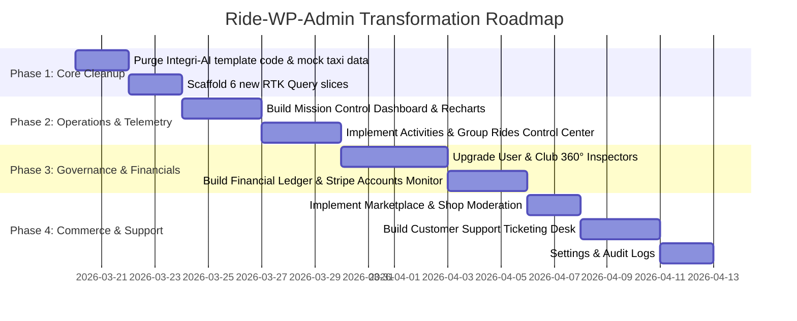

# Ride With Pals — Admin Panel Comprehensive Analysis & Master Walkthrough

> **Document Type:** System Analysis, Architecture Blueprint & Backend API Specification  
> **Target Project:** `Ride-WP-Admin` (`C:\Users\Prime\OneDrive\Documents\Office\Office Projects\Ride-WP-Admin`)  
> **Companion App:** `Ride-WP` (`C:\Users\Prime\OneDrive\Documents\Office\Office Projects\Ride-WP`)  
> **Date:** March 2026  
> **Version:** 2.0.0 (Production Blueprint)

---

## 1. Executive Summary & Forensic Audit of Current Admin Panel

### 1.1 The Reality of the Current `Ride-WP-Admin` Repository
An exhaustive inspection of the current admin codebase (`C:\Users\Prime\OneDrive\Documents\Office\Office Projects\Ride-WP-Admin`) reveals:
1. **Legacy Transportation Template Artifacts:**
   - The dashboard page ([`DashboardPage.tsx`](file:///c:/Users/Prime/OneDrive/Documents/Office/Office%20Projects/Ride-WP-Admin/src/features/dashboard/pages/DashboardPage.tsx)) still carries title and subtitles from a legacy ride-hailing / taxi dispatch template:
     - Header: *"Mission Control | Integri-AI Admin"*
     - Subtitle: *"Real-time surveillance & telemetry across the Integri-AI transportation network"*
     - Metric cards display *"System Active Drivers"*, *"Active Inter-City Clubs"*, *"Total Matched Matches"*, and currency in *"PKR"* ([`MetricCards.tsx`](file:///c:/Users/Prime/OneDrive/Documents/Office/Office%20Projects/Ride-WP-Admin/src/features/analytics/components/MetricCards.tsx)).
     - Displays hardcoded mock arrays: `MOCK_FEEDBACK` and `MOCK_LIVE_RIDES`.
2. **Current API Coverage (Only 20 Endpoints):**
   - The entire backend integration is restricted to 6 RTK Query slices handling only 20 basic CRUD endpoints:
     - `authApi.ts`: `POST /admin/login` (1 endpoint)
     - `userApi.ts`: `GET /admin/users`, `GET /admin/users/:id`, `PUT /admin/users/:id/suspend`, `DELETE /admin/users/:id` (4 endpoints)
     - `clubApi.ts`: `GET /admin/clubs`, `GET /admin/clubs/:id?tab=...`, `PUT /admin/clubs/:id/suspend`, `DELETE /admin/clubs/:id` (4 endpoints)
     - `subscriptionApi.ts`: CRUD for SaaS subscription plans (`POST`, `GET`, `PUT`, `DELETE /admin/subscription/plan`) (5 endpoints)
     - `notificationApi.ts`: Push broadcasts (`POST /admin/notifications/send`, picker, logs) (3 endpoints)
     - `cmsApi.ts`: Dual-language legal policies (`GET`, `PUT /admin/content/:key`) (3 endpoints)
3. **Hardcoded Mock Pages:**
   - `PaymentsPage.tsx`: Uses `mockTransactions` array with hardcoded `$45,231.89` total balance instead of real Stripe Connect financial data.
   - `AnalyticsPage.tsx`: Uses static pie/bar charts with mock taxi data.
   - `SupportPage.tsx`: Built with a generic socket.io chat room that is disconnected from the actual support tickets and inquiries sent by mobile/web users.

---

### 1.2 Feature Gap Comparison: Live Client App vs. Current Admin Panel

| Domain / Feature in Client App (`Ride-WP`) | Client App Reality | Current Admin Panel Status | Gap / Risk Severity |
| :--- | :--- | :--- | :--- |
| **Group Rides & GPX Routes** | Multi-sport routes (Road, Gravel, MTB, Trail), GPX files, waypoint stops, pace categories, ride leaders, support cars, RSVPs | **Completely Missing** (0 endpoints, 0 screens) | **CRITICAL:** Admin has zero oversight over the core product. |
| **Club Membership Fees** | Stripe Connect onboarding, annual/monthly fee plans, manual cash payments, fee rosters, payment reminders | **Completely Missing** (No fee oversight, no Stripe Connect merchant monitoring) | **HIGH:** Cannot track club compliance or revenue. |
| **Club Merchandise Shop** | Kit catalog, sizes, inventory, discount vouchers, Stripe Checkout orders, delivery statuses | **Completely Missing** (No cross-club order monitor) | **HIGH:** Cannot mediate delivery failures or dispute delays. |
| **Peer-to-Peer Marketplace** | Community classifieds, condition ratings, pricing, gear photos, seller messaging | **Completely Missing** (No moderation or take-down tools) | **HIGH:** Risk of counterfeit goods, stolen bikes, or fraud. |
| **Financial Ledger & Commissions** | Club earnings, payout balances, platform fee deductions | **Hardcoded Mock Data** (`mockTransactions`) | **CRITICAL:** Admin cannot see actual revenue or fees collected. |
| **Strava Integration & Leaderboards** | OAuth sync, distance rankings (km), ride count rankings | **Completely Missing** (No sync telemetry or error logs) | **MEDIUM:** Cannot audit API quotas or sync health. |
| **Customer Support & Disputes** | Athletes and clubs message support for billing and safety issues | **Generic Chat Socket** (No ticket queue, priority triage, or refund actions) | **HIGH:** Inquiries go unanswered without a ticketing desk. |

---

## 2. Master Blueprint: The Transformed Admin Control Center

```mermaid
graph TD
    Root["Ride With Pals — Admin Control Center"]
    
    Root --> M1["1. Executive Mission Control<br/>(Real-Time Analytics, MRR, GMV, Ride Heatmap)"]
    Root --> M2["2. User & Athlete Governance<br/>(360° Dossier, Rides, Clubs, Purchases, Moderation)"]
    Root --> M3["3. Club Governance & Oversight<br/>(Roster, RBAC Toggles, Stripe Status, Fee Plans)"]
    Root --> M4["4. Activities & Group Rides Desk<br/>(GPX Route Viewer, Elevation, Roster, Cancellations)"]
    Root --> M5["5. Financial Operations & Ledger<br/>(SaaS Subscriptions, Stripe Connect, Payout Approvals)"]
    Root --> M6["6. Commerce & Marketplace Operations<br/>(P2P Gear Moderation, Shop Delivery Bottlenecks)"]
    Root --> M7["7. Support Helpdesk & Disputes<br/>(Ticketing Queue, Priority Triage, Refund Actions)"]
    Root --> M8["8. Broadcasts & Engagement Engine<br/>(Segmented Push Notifications, Deep Linking)"]
    Root --> M9["9. Dual-Language Legal CMS<br/>(EN/ES Markdown Editor, Terms, Privacy, Guidelines)"]
    Root --> M10["10. System Settings & Audit Trails<br/>(Platform Fees, Min App Versions, Immutable Logs)"]
```



---

## 3. Screen-by-Screen Implementation Walkthrough

### Screen 1: Executive Mission Control (`/dashboard`)
- **Top Metrics Row:**
  - `Total Athletes`: Real-time user count + MoM growth percentage.
  - `Verified Clubs`: Active clubs count + Pro verification percentage.
  - `Active Rides This Week`: Scheduled and ongoing rides count.
  - `Platform GMV`: Gross transaction volume across all fees and shop orders.
  - `Monthly Recurring Revenue (MRR)`: SaaS subscriptions (Athlete Pro + Gold Club).
  - `Strava Sync Rate`: Percentage of registered athletes with connected Strava.
- **Charts & Visualizations:**
  - *Revenue Composition Engine (Recharts Area Chart):* Compares SaaS Subscriptions vs. Club Membership Platform Cuts vs. Shop Commissions over 30d, 6m, and 1y.
  - *Active Ride Clusters (Leaflet Map):* Global map visualizing upcoming ride start locations and participant density.
- **Operational Alerts Feed:**
  - Flags clubs with restricted Stripe payouts.
  - Flags marketplace listings reported by users.
  - Surfaces unresolved support tickets past SLA (>24 hours).

---

### Screen 2: User Governance & 360° Athlete Dossier (`/users` & `/users/:id`)
- **Directory Table (`/users`):**
  - Columns: Avatar, Full Name & Email, Country, Subscription Tier (`Free`/`Pro`), Strava Status (`Connected`/`Off`), Joined Clubs Count, Rides Count, Status (`Active`/`Suspended`), Action Menu.
  - Filters: Text search (debounced), Role filter, Pro filter, Strava filter, Suspension status.
- **360° Athlete Dossier Drawer (`/users/:id`):**
  - *Header:* Profile picture, full name, email, phone, location, measurement scale (`metric`/`imperial`), joined date, Strava Athlete ID.
  - *Tab 1 — Activities:* List of created and attended rides with distance (km), pace, and GPX download links.
  - *Tab 2 — Clubs & Roles:* Clubs joined, assigned role (`Owner`/`Admin`/`User`), membership fee status (`Paid`/`Pending`/`Exempt`).
  - *Tab 3 — Purchases:* Merchandise orders placed by the athlete with fulfillment tracking.
  - *Tab 4 — Marketplace Listings:* Pre-owned items listed by this user with condition and price.
  - *Tab 5 — Moderation:* Suspend/Unsuspend with reason input, Force Password Reset, GDPR Data Export, Soft Delete.

---

### Screen 3: Club Governance & Deep Inspector (`/clubs` & `/clubs/:id`)
- **Club Directory (`/clubs`):**
  - Columns: Logo, Club Name, Owner Name & Email, Location, Member Count, Privacy (`Public`/`Private`), Tier (`Free`/`Gold`), Stripe Connect Status, Verified Badge, Actions.
- **Club Deep Inspector (`/clubs/:id`):**
  - *Tab 1 — Overview & KPIs:* Monthly ride completion rate, member growth curve, total membership fees collected.
  - *Tab 2 — Member Roster & RBAC:* Member table showing delegated permission toggles (`publishRides`, `publishNews`, `publishDiscount`, `acceptOrBanUsers`, `manageMembershipFee`, `isFullAccess`). Admin can revoke access or reassign club ownership.
  - *Tab 3 — Financials & Stripe:* Stripe Account ID (`acct_...`), payout status, active fee plans, offline cash payment log, fee-exempt members.
  - *Tab 4 — Group Rides:* History of all past and upcoming rides hosted by the club.
  - *Tab 5 — Merchandise:* Club kit items, stock levels, and order fulfillment status.
  - *Tab 6 — Community Feed:* Club news posts and comments with moderation delete actions.
  - *Actions:* Grant Pro Verification Badge, Suspend Club, Disband Club.

---

### Screen 4: Activities & Group Rides Control Center (`/rides`)
- **Rides Directory:**
  - Columns: Ride Title, Host Club, Date & Start Time, Sport Type (`Road`/`Gravel`/`MTB`/`Trail`), Pace Category, Distance (km), Confirmed RSVPs / Slots, Ride Leaders, Status (`Upcoming`/`Completed`/`Cancelled`), Actions.
  - Filters: Sport type, Category pace, Date range, Club selector, Paid/Free.
- **Ride Inspector Modal:**
  - Leaflet GPX track viewer displaying start point, rest stops, elevation profile, and distance.
  - Staff verification: Assigned Ride Leaders and Support Car Driver.
  - Participant attendance roster.
  - *Emergency Cancellation:* Cancels the ride and triggers an automated push notification to all RSVP'd participants explaining the cancellation.

---

### Screen 5: Financial Operations, Ledger & Payouts (`/payments`)
- **Sub-Tab 1 — Platform Ledger:**
  - Chronological transaction feed: SaaS Subscriptions, Club Membership Dues, Shop Kit Purchases.
  - Displays: Gross Amount, Platform Fee Cut (e.g. 5%), Net to Club, Stripe Payment Intent ID, Status.
- **Sub-Tab 2 — Stripe Connect Accounts:**
  - Real-time status of club merchant accounts: `Charges Enabled`, `Payouts Enabled`, `Details Submitted`, Available Balance.
- **Sub-Tab 3 — Manual Payout Approvals:**
  - For clubs using manual/offline fee collection requesting accumulated platform balance withdrawals. Admin can approve and upload bank transfer receipts.
- **Sub-Tab 4 — Subscription Tier Configurator:**
  - Create and edit Athlete Pro and Gold Club SaaS tiers with feature entitlement toggles (`unlimitedRides`, `stravaConnection`, `gpxDownload`, `clubStripeIntegration`).

---

### Screen 6: E-Commerce & Marketplace Governance (`/commerce`)
- **Sub-Tab 1 — Marketplace Moderation:**
  - Grid and table view of all user gear listings with photos, condition, price, and seller info.
  - Actions: Take Down Listing (with reason sent to seller), Mark as Verified.
- **Sub-Tab 2 — Club Shop Catalog:**
  - Overview of all club apparel across the platform, inventory counts, and pricing.
- **Sub-Tab 3 — Order Bottleneck Monitor:**
  - Detects club shop orders stuck in `Pending` status > 7 days, allowing admins to notify the club organizer.

---

### Screen 7: Customer Support & Dispute Desk (`/support`)
- **Ticket Inbox:**
  - Columns: Ticket ID, User / Club Name, Subject, Category (`Billing`, `Ride Safety`, `Account`, `Dispute`), Priority (`Urgent`, `High`, `Normal`), Assigned Agent, Status (`Open`, `In Progress`, `Resolved`, `Closed`).
- **Split-Screen Ticket Workspace:**
  - Left: User account snapshot, linked transaction/ride ID, internal private notes.
  - Right: Conversation thread. Outbound admin replies deliver directly via mobile push and in-app chat.
  - Quick Actions: `Issue Stripe Refund`, `Reset User Password`, `Mark as Resolved`.

---

### Screen 8: Push Broadcasts & Audience Segments (`/notifications`)
- **Audience Targeting:** `All Users`, `Pro Athletes Only`, `Club Owners Only`, `Inactive Users (>30 days)`, or custom user picker.
- **Composer:** Title, Body, Deep-Link Route (`/club/:id`, `/ride/:id`, `/subscription`), Image URL.
- **Transmission Log:** Delivery timestamp, recipient count, delivery status.

---

### Screen 9: Legal CMS & Content Management (`/cms`)
- **Documents:** Terms of Service, Privacy Policy, Community Guidelines, About Ride With Pals.
- **Dual-Language Editor:** Side-by-side English (`EN`) and Spanish (`ES`) Markdown editor with live preview.

---

### Screen 10: Platform Settings & Audit Logs (`/settings`)
- **Global Variables:** Platform fee percentage (e.g. 5.0%), minimum iOS and Android versions (force-update enforcement), maintenance mode toggle.
- **Admin RBAC:** Manage team accounts: `Super Admin`, `Support Agent`, `Content Moderator`, `Finance Manager`.
- **Immutable Audit Log:** Filterable log of administrative actions (`Admin X suspended User Y`, `Admin Z refunded Order #8491`) with timestamps and IP addresses.

---

## 4. Backend Developer API Specification Walkthrough

Provide this section directly to your backend developer. All endpoints follow the standard API envelope:
```json
{
  "statusCode": 200,
  "message": "Human-readable status description.",
  "response": { /* Entity payload */ }
}
```

---

### Domain 1: Dashboard & Analytics APIs

#### `GET /admin/analytics/overview`
- **Purpose:** Supplies primary stats cards on the executive dashboard.
- **Response `200 OK`:**
```json
{
  "statusCode": 200,
  "response": {
    "totalAthletes": 12840,
    "athletesGrowthMoM": 14.2,
    "totalClubs": 428,
    "clubsGrowthMoM": 8.1,
    "activeRidesThisWeek": 1215,
    "ridesGrowthMoM": 22.0,
    "platformGmvEur": 148250.00,
    "mrrEur": 9840.00,
    "stravaSyncRate": 76.4,
    "pendingDisputesCount": 3,
    "flaggedListingsCount": 2
  }
}
```

#### `GET /admin/analytics/revenue-chart?range=6months`
- **Query Parameters:** `range` (`30days`, `6months`, `1year`)
- **Response `200 OK`:**
```json
{
  "statusCode": 200,
  "response": [
    {
      "month": "Oct 2025",
      "saasSubscriptions": 6400.00,
      "clubMembershipCut": 1850.00,
      "shopCommission": 420.00,
      "totalRevenue": 8670.00
    },
    {
      "month": "Nov 2025",
      "saasSubscriptions": 7200.00,
      "clubMembershipCut": 2100.00,
      "shopCommission": 540.00,
      "totalRevenue": 9840.00
    }
  ]
}
```

#### `GET /admin/analytics/activity-map`
- **Response `200 OK`:** Returns array of upcoming/ongoing rides with latitude, longitude, club name, and participant count.

---

### Domain 2: User Governance & Dossier APIs

#### `GET /admin/users` (Extended)
- **Query Parameters:** `offset`, `limit`, `search`, `role`, `isPro`, `status` (`active`, `suspended`)
- **Response `200 OK`:**
```json
{
  "statusCode": 200,
  "response": {
    "count": 12840,
    "rows": [
      {
        "id": 55,
        "fullName": "Alex Morgan",
        "email": "alex@example.com",
        "profileImage": "https://cdn.ridewithpals.com/avatars/55.jpg",
        "country": "Spain",
        "unit": "km",
        "isPro": true,
        "stravaConnected": true,
        "clubsCount": 3,
        "ridesCount": 42,
        "isSuspended": false,
        "createdAt": "2025-08-14T09:20:00.000Z"
      }
    ]
  }
}
```

#### `GET /admin/users/:id/dossier`
- **Response `200 OK`:** Returns athlete profile, linked clubs, registered rides, shop purchase history, and active marketplace listings.

#### `PUT /admin/users/:id/suspend`
- **Request Body:** `{ "isSuspended": true, "reason": "Violation of community safety guidelines" }`

---

### Domain 3: Club Governance & Deep Inspector APIs

#### `GET /admin/clubs` (Extended)
- **Query Parameters:** `offset`, `limit`, `search`, `privacyId`, `isVerified`, `stripeStatus`, `status`
- **Response `200 OK`:**
```json
{
  "statusCode": 200,
  "response": {
    "count": 428,
    "rows": [
      {
        "id": 12,
        "clubName": "Girona Gravel Club",
        "logo": "https://cdn.ridewithpals.com/clubs/12.jpg",
        "ownerId": 41,
        "ownerName": "Marc Soler",
        "ownerEmail": "marc@girona.cc",
        "location": "Girona, Spain",
        "memberCount": 128,
        "privacy": "Public",
        "tier": "Gold Club",
        "stripeConnected": true,
        "stripeStatus": "active",
        "isVerified": true,
        "isSuspended": false,
        "createdAt": "2025-06-10T12:00:00.000Z"
      }
    ]
  }
}
```

#### `GET /admin/clubs/:id/inspect`
- **Response `200 OK`:** Returns club profile, owner dossier, full member roster with permission toggles, Stripe Connect account details, active membership plans, monthly GMV, and recent ride activities.

#### `PUT /admin/clubs/:id/verify`
- **Request Body:** `{ "isVerified": true }`

#### `PUT /admin/clubs/:id/transfer-ownership`
- **Request Body:** `{ "newOwnerId": 55, "reason": "Requested by previous owner" }`

---

### Domain 4: Activities & Group Rides APIs

#### `GET /admin/rides`
- **Query Parameters:** `offset`, `limit`, `search`, `clubId`, `sportTypeId`, `dateFrom`, `dateTo`, `status` (`upcoming`, `completed`, `cancelled`)
- **Response `200 OK`:**
```json
{
  "statusCode": 200,
  "response": {
    "count": 1215,
    "rows": [
      {
        "id": 108,
        "rideName": "Costa Brava Epic",
        "clubId": 12,
        "clubName": "Girona Gravel Club",
        "date": "2026-03-28",
        "time": "08:30:00",
        "distance": "85.0",
        "meetingPoint": "Plaça de la Independència, Girona",
        "isPublic": true,
        "isPaymentRequired": false,
        "confirmedParticipants": 34,
        "slotsLimit": 50,
        "status": "upcoming",
        "leaders": ["Marc Soler", "Jordi P."],
        "supportCarDriver": "Carlos V."
      }
    ]
  }
}
```

#### `GET /admin/rides/:id`
- **Response `200 OK`:** Returns full route details, raw GPX download URL, waypoint stops, participant attendance roster, and emergency contact flags.

#### `DELETE /admin/rides/:id`
- **Request Body:** `{ "cancellationReason": "Severe weather advisory", "sendPushNotification": true }`

---

### Domain 5: Financial Operations & Payout APIs

#### `GET /admin/financials/ledger`
- **Query Parameters:** `offset`, `limit`, `type` (`all`, `platform_subscription`, `club_membership`, `shop_order`), `startDate`, `endDate`
- **Response `200 OK`:**
```json
{
  "statusCode": 200,
  "response": {
    "summary": {
      "totalGross": 148250.00,
      "totalPlatformFees": 9840.00,
      "currency": "EUR"
    },
    "rows": [
      {
        "transactionId": "txn_94821",
        "date": "2026-03-18T11:42:00.000Z",
        "type": "club_membership",
        "source": "Girona Gravel Club",
        "payer": "Alex Morgan",
        "grossAmount": 25.00,
        "platformFee": 1.25,
        "netAmount": 23.75,
        "currency": "EUR",
        "stripePaymentIntentId": "pi_3Nqxxx",
        "status": "succeeded"
      }
    ]
  }
}
```

#### `GET /admin/financials/stripe-accounts`
- **Query Parameters:** `offset`, `limit`, `status` (`active`, `restricted`, `pending`)
- **Response `200 OK`:** Returns accounts with payout status, charges enabled, details submitted, and available balances.

#### `PUT /admin/financials/payouts/:payoutId/approve`
- **Request Body:** `{ "transferReference": "SEPA-WIRE-984128", "receiptUrl": "https://...", "notes": "Corporate bank wire" }`

---

### Domain 6: Commerce & Marketplace Governance APIs

#### `GET /admin/marketplace/listings`
- **Query Parameters:** `offset`, `limit`, `search`, `condition`, `isFlagged`, `isSoldOut`
- **Response `200 OK`:** Returns paginated listings with seller info, price, condition, and report counts.

#### `PUT /admin/marketplace/listings/:id/moderate`
- **Request Body:** `{ "isActive": false, "reason": "Prohibited merchandise" }`

#### `GET /admin/shop/orders/bottlenecks`
- **Query Parameters:** `delayedDaysThreshold=7`
- **Response `200 OK`:** Returns orders with `Pending` status exceeding the day threshold.

---

### Domain 7: Customer Support & Dispute Desk APIs

#### `GET /admin/support/tickets`
- **Query Parameters:** `offset`, `limit`, `status` (`open`, `in_progress`, `resolved`, `closed`), `priority`, `category`
- **Response `200 OK`:** Returns ticket queue with user details, priority, and last message.

#### `GET /admin/support/tickets/:id/messages`
- **Response `200 OK`:** Full conversational thread, including internal staff notes.

#### `POST /admin/support/tickets/:id/reply`
- **Request Body:**
```json
{
  "message": "We have verified the duplicate charge and issued an immediate refund of €89.00.",
  "isInternalNote": false,
  "status": "resolved"
}
```

---

### Domain 8: System Settings & Audit Log APIs

#### `GET /admin/settings` & `PUT /admin/settings`
- **Request / Response Body:**
```json
{
  "platformFeePercentage": 5.0,
  "minIosVersion": "1.2.0",
  "minAndroidVersion": "1.2.0",
  "forceUpdateEnabled": false,
  "maintenanceMode": false,
  "maxMarketplaceImages": 5
}
```

#### `GET /admin/audit-logs`
- **Query Parameters:** `offset`, `limit`, `adminId`, `actionType`, `startDate`, `endDate`
- **Response `200 OK`:** Chronological audit trail of all administrative actions.

---

## 5. Step-by-Step Frontend Technical Implementation Roadmap



### Immediate File Action Items in `Ride-WP-Admin`:

1. **Delete / Refactor Legacy Files:**
   - Modify [`DashboardPage.tsx`](file:///c:/Users/Prime/OneDrive/Documents/Office/Office%20Projects/Ride-WP-Admin/src/features/dashboard/pages/DashboardPage.tsx): Replace "Integri-AI" title and taxi terminology with the new Mission Control layout.
   - Modify [`MetricCards.tsx`](file:///c:/Users/Prime/OneDrive/Documents/Office/Office%20Projects/Ride-WP-Admin/src/features/analytics/components/MetricCards.tsx): Replace "PKR", "System Active Drivers", and "Inter-City Clubs" with real Ride With Pals metrics.
   - Modify [`PaymentsPage.tsx`](file:///c:/Users/Prime/OneDrive/Documents/Office/Office%20Projects/Ride-WP-Admin/src/features/payments/pages/PaymentsPage.tsx): Replace `mockTransactions` with the new `financialsApi` RTK Query hook.
   - Refactor [`SupportPage.tsx`](file:///c:/Users/Prime/OneDrive/Documents/Office/Office%20Projects/Ride-WP-Admin/src/features/support/pages/SupportPage.tsx): Connect the chat layout to real support ticket threads.

2. **Add Missing RTK Query Slices under `src/features/`:**
   - `src/features/analytics/api/analyticsApi.ts` (`getOverview`, `getRevenueChart`, `getActivityMap`)
   - `src/features/rides/api/ridesAdminApi.ts` (`getRidesList`, `getRideDossier`, `cancelRide`)
   - `src/features/financials/api/financialsApi.ts` (`getLedger`, `getStripeAccounts`, `approvePayout`)
   - `src/features/marketplace/api/marketplaceAdminApi.ts` (`getListings`, `moderateListing`, `getShopBottlenecks`)
   - `src/features/support/api/supportTicketsApi.ts` (`getTickets`, `getTicketThread`, `replyTicket`)
   - `src/features/settings/api/settingsApi.ts` (`getSettings`, `updateSettings`, `getAuditLogs`)

3. **Update Router in `src/app/router.tsx`:**
   - Add `/rides` route mapping to the Activities Control Center.
   - Add `/commerce` route mapping to Marketplace & Shop Moderation.
   - Add `/financials` route mapping to the Financial Operations Ledger.
   - Add `/settings` route mapping to Platform Configuration & Audit Logs.
