# Ride With Pals (Admin) — Comprehensive API Analysis & Walkthrough

> **Document Type:** API Architecture & Implementation Analysis  
> **Source Collection:** `Admin.postman_collection.json` (Postman Schema v2.1.0)  
> **Application Context:** Ride With Pals — Admin Control Center (React 18, TypeScript, Redux Toolkit Query, Axios)  
> **Backend Environment:** Express.js REST API  

---

## 1. Executive Architectural Overview

The **Ride With Pals (Admin)** system is powered by an Express.js REST API supporting both a React-based Web Admin Dashboard and native mobile applications (iOS/Android).

### 1.1 Architecture & Transport Layer
* **Base URLs:**
  * Local Development: `{{local}}` (typically `http://localhost:5000/api/` or `http://localhost:3000/api/`)
  * Production / Staging: `{{LIVE}}` (e.g., `https://api.ridewithpals.com/api`)
* **Transport & Cache Architecture:**
  * Built using **RTK Query** via a custom Axios baseQuery transport layer ([`src/api/baseQuery.ts`](file:///c:/Users/Prime/OneDrive/Documents/Office/Office%20Projects/Ride-WP-Admin/src/api/baseQuery.ts)).
  * Interceptors automatically inject the JWT token from `localStorage` under `STORAGE_KEYS.AUTH_TOKEN` (`rwp_admin_token`) into the `Authorization: Bearer <token>` header.
  * Tag-based automated cache invalidation (`Users`, `Clubs`, `Plans`, `NotificationHistory`, `CMS`) ensures immediate UI reactivity upon CRUD operations.

### 1.2 Universal Response Envelope
All API endpoints follow a standardized JSON envelope structure:
```json
{
  "statusCode": 200,
  "message": "Human-readable status description.",
  "response": { /* Payload or entity */ }
}
```
In RTK Query slices, `transformResponse` unwraps `response.response` directly into the component state.

---

## 2. API Logical Grouping & Domain Matrix

The 20 endpoints in the Postman collection are categorized into **6 core business domains**:

```mermaid
graph TD
    A[Admin API Suite] --> B[1. Authentication & Access Control]
    A --> C[2. User Management & Moderation]
    A --> D[3. Monetization & Subscription Plans]
    A --> E[4. Club Governance & Community Oversight]
    A --> F[5. Push Notifications & Engagement]
    A --> G[6. System Content & CMS]

    B --> B1[admin/login]
    
    C --> C1[admin/users: List]
    C --> C2[admin/users/:id: Details]
    C --> C3[admin/users/:id/suspend: Suspend]
    C --> C4[admin/users/:id: Delete]

    D --> D1[admin/subscription/plan: Create]
    D --> D2[admin/subscription/plans: List]
    D --> D3[admin/subscription/plan: Get by ID]
    D --> D4[admin/subscription/plan: Update]
    D --> D5[admin/subscription/plan: Delete]

    E --> E1[admin/clubs: List]
    E --> E2[admin/clubs/:id: Details & Tabs]
    E --> E3[admin/clubs/:id/suspend: Suspend]
    E --> E4[admin/clubs/:id: Delete]

    F --> F1[admin/notifications/send: Broadcast/Targeted]
    F --> F2[admin/users/picker: User Selector]
    F --> F3[admin/notifications/history: Logs]

    G --> G1[public/content/:key: Public Mobile View]
    G --> G2[admin/content/:key: Admin View]
    G --> G3[admin/content/:key: Update CMS]
```



| Group | Domain | Total Endpoints | Primary Operations | Target Consumers |
| :--- | :--- | :---: | :--- | :--- |
| **Group 1** | **Authentication & Access** | 1 | Admin Login & Session Generation | Web Admin Portal |
| **Group 2** | **User Management** | 4 | Search, Inspect Profile/Rides/Clubs/Listings, Suspend, Delete | Web Admin Portal |
| **Group 3** | **Subscription & Plans** | 5 | Tier Configuration (Free, Monthly, Yearly, Gold), Stripe Integration | Web Admin Portal / Stripe |
| **Group 4** | **Club Management** | 4 | Club Discovery, Tabbed Insights (Rides, Members, etc.), Suspend, Delete | Web Admin Portal |
| **Group 5** | **Push Notifications** | 3 | Segment Broadcasting, User Picker, Transmission Logs | Web Admin Portal / Mobile Devices |
| **Group 6** | **System Content (CMS)** | 3 | Legal Policies (Privacy, Terms, About) in Multi-Language (EN/ES) | Web Admin & Mobile App |

---

## 3. Detailed Endpoint-by-Endpoint Walkthrough

---

### GROUP 1: Authentication & Access Control

#### 1.1 Admin Login
* **Method & Route:** `POST /admin/login`
* **Postman URL:** `{{LIVE}}admin/login`
* **Authentication:** Public (`noauth`)
* **Purpose:** Authenticates administrative users using email/password credentials and issues a signed JSON Web Token (JWT) along with admin profile metadata.
* **Use Case:**
  * Initial entry to the Admin Control Center when an unauthenticated session is detected.
  * Triggered upon submitting the login credentials on the admin login page.
* **Location of Use in Application:**
  * **Page / Route:** `/login` ([`src/features/auth/components/LoginPage.tsx`](file:///c:/Users/Prime/OneDrive/Documents/Office/Office%20Projects/Ride-WP-Admin/src/features/auth/components/LoginPage.tsx))
  * **Component:** [`LoginForm.tsx`](file:///c:/Users/Prime/OneDrive/Documents/Office/Office%20Projects/Ride-WP-Admin/src/features/auth/components/LoginForm.tsx)
  * **API Hook:** `useLoginAdminMutation` in [`src/features/auth/api/authApi.ts`](file:///c:/Users/Prime/OneDrive/Documents/Office/Office%20Projects/Ride-WP-Admin/src/features/auth/api/authApi.ts)
  * **State Handlers:** Dispatches `setCredentials({ user, token })` to [`authSlice.ts`](file:///c:/Users/Prime/OneDrive/Documents/Office/Office%20Projects/Ride-WP-Admin/src/features/auth/slices/authSlice.ts) and stores token in `localStorage.setItem('rwp_admin_token', token)`.
* **Request Payload:**
  ```json
  {
    "email": "admin@gmail.com",
    "password": "Password123"
  }
  ```
* **Response Payload (200 OK):**
  ```json
  {
    "statusCode": 200,
    "message": "Admin logged in successfully.",
    "response": {
      "id": 1,
      "email": "admin@gmail.com",
      "name": "Admin",
      "role": "admin",
      "token": "eyJhbGciOiJIUzI1NiIsInR5cCI6IkpXVCJ9..."
    }
  }
  ```

---

### GROUP 2: User Management & Moderation

#### 2.1 Get Users List
* **Method & Route:** `GET /admin/users`
* **Postman URL:** `{{local}}admin/users?offset=0&limit=10&search`
* **Authentication:** Bearer Token (`{{adminToken}}`)
* **Query Parameters:**
  * `offset` *(number, required)*: Pagination start index (e.g., `0`, `10`).
  * `limit` *(number, required)*: Page size (e.g., `10`).
  * `search` *(string, optional)*: Query string filtering by user name or email.
* **Purpose:** Retrieves a paginated directory of registered riders and club members across the platform, including their subscription tiers, suspension status, and club counts.
* **Use Case:**
  * Populating the primary user management table.
  * Instant search and debounced filtering when looking up users.
  * Pagination navigation across large user databases.
* **Location of Use in Application:**
  * **Page / Route:** `/users` ([`src/features/users/pages/UsersPage.tsx`](file:///c:/Users/Prime/OneDrive/Documents/Office/Office%20Projects/Ride-WP-Admin/src/features/users/pages/UsersPage.tsx))
  * **Component:** [`DataTable.tsx`](file:///c:/Users/Prime/OneDrive/Documents/Office/Office%20Projects/Ride-WP-Admin/src/Components/ui/DataTable.tsx) inside `UsersPage.tsx`
  * **Secondary Use:** [`RecipientSelector.tsx`](file:///c:/Users/Prime/OneDrive/Documents/Office/Office%20Projects/Ride-WP-Admin/src/features/notifications/components/RecipientSelector.tsx) for targeted push notifications.
  * **API Hook:** `useGetUsersListQuery` in [`src/features/users/api/userApi.ts`](file:///c:/Users/Prime/OneDrive/Documents/Office/Office%20Projects/Ride-WP-Admin/src/features/users/api/userApi.ts)
  * **Cache Tags:** Provides `{ type: 'Users', id: 'LIST' }` and `{ type: 'Users', id: user.id }`.
* **Response Payload (200 OK):**
  ```json
  {
    "statusCode": 200,
    "message": "Users fetched successfully.",
    "response": {
      "users": [
        {
          "id": 1,
          "fullName": "Saqib Usman",
          "email": "tech54qi@gmail.com",
          "phone": "+92333333333",
          "profileImage": "saqi.png",
          "isSuspended": false,
          "clubsJoined": 3,
          "subscriptionPlan": "Monthly Subscription",
          "startDate": "2026-06-13T13:28:34.000Z",
          "endDate": "2026-06-27T13:28:34.000Z",
          "createdAt": "2026-02-09T08:25:48.000Z"
        }
      ],
      "pagination": {
        "total": 2,
        "offset": 0,
        "limit": 10
      }
    }
  }
  ```

#### 2.2 Get User Info By ID
* **Method & Route:** `GET /admin/users/:userId`
* **Postman URL:** `{{LIVE}}admin/users/1`
* **Authentication:** Bearer Token (`{{adminToken}}`)
* **Path Parameters:**
  * `userId` *(number/string, required)*: Unique database ID of the user.
* **Purpose:** Retrieves a 360-degree comprehensive user audit dossier, including rider biography, mileage metrics, joined clubs, participating rides, and marketplace product listings.
* **Use Case:**
  * Displaying the comprehensive user profile inspection page.
  * Reviewing a user's rides history, club memberships, and marketplace items for community trust & safety checks.
* **Location of Use in Application:**
  * **Page / Route:** `/users/:id` ([`src/features/users/pages/UserDetailPage.tsx`](file:///c:/Users/Prime/OneDrive/Documents/Office/Office%20Projects/Ride-WP-Admin/src/features/users/pages/UserDetailPage.tsx))
  * **Components:**
    * Profile Header & Metric Cards (`totalRides`, `distanceCovered`, `userReputation`).
    * [`DetailTabs.tsx`](file:///c:/Users/Prime/OneDrive/Documents/Office/Office%20Projects/Ride-WP-Admin/src/features/users/components/DetailTabs.tsx) (Tabs: Rides, Clubs, Listings, Purchases).
  * **API Hook:** `useGetUserByIdQuery({ userId })` in [`src/features/users/api/userApi.ts`](file:///c:/Users/Prime/OneDrive/Documents/Office/Office%20Projects/Ride-WP-Admin/src/features/users/api/userApi.ts)
  * **Cache Tags:** Provides `{ type: 'Users', id: userId }`.
* **Response Payload (200 OK):**
  ```json
  {
    "statusCode": 200,
    "message": "User details fetched successfully.",
    "response": {
      "profile": {
        "id": 1,
        "fullName": "Saqib Usman",
        "email": "tech54qi@gmail.com",
        "phone": "+92333333333",
        "profileImage": "saqi.png",
        "isSuspended": false,
        "subscriptionPlan": "Monthly Subscription",
        "startDate": "2026-06-13T13:28:34.000Z",
        "endDate": "2026-06-27T13:28:34.000Z",
        "clubsJoined": 3
      },
      "stats": {
        "totalRides": 6,
        "distanceCovered": "178 km",
        "userReputation": "4.8"
      },
      "rides": [
        {
          "id": 1,
          "dateTime": "2025-02-15T03:30:00.000Z",
          "route": "Central Park North Gate, 110th St → null",
          "hostName": "Weekend Riders Club 2",
          "status": "Completed",
          "distance": "35.50",
          "pace": "Moderate (15-18 km/h)",
          "participantsCount": 1,
          "rideName": "Saturday Mornings Bike Ride",
          "gpxFile": "https://example.com/routes/morning-ride.gpx"
        }
      ],
      "clubs": [
        {
          "id": 1,
          "clubName": "Weekend Riders Club",
          "memberCount": "1 Members",
          "role": "Admin",
          "joinedDate": "2026-06-23T12:27:27.000Z"
        }
      ],
      "listings": [
        {
          "id": 2,
          "productName": "saqi",
          "price": "23.00",
          "condition": "used",
          "image": "profile.jpg",
          "description": "Used cycling helmet in good condition",
          "isActive": false,
          "isSoldOut": true,
          "createdAt": "2026-04-21T12:03:12.000Z"
        }
      ],
      "purchases": []
    }
  }
  ```

#### 2.3 Suspend User
* **Method & Route:** `PUT /admin/users/:userId/suspend`
* **Postman URL:** `{{local}}admin/users/1/suspend`
* **Authentication:** Bearer Token (`{{adminToken}}`)
* **Path Parameters:**
  * `userId` *(number/string)*: Unique database ID of the user.
* **Purpose:** Moderation action allowing administrators to block or unblock a user's access to the mobile app, rides, chats, and marketplace.
* **Use Case:**
  * Suspending a user for terms violation or malicious behavior.
  * Unsuspending a rehabilitated or cleared account (`isSuspended: false`).
* **Location of Use in Application:**
  * **Component:** [`UserActionsMenu.tsx`](file:///c:/Users/Prime/OneDrive/Documents/Office/Office%20Projects/Ride-WP-Admin/src/features/users/components/UserActionsMenu.tsx) (Dropdown menu on each row in `UsersPage.tsx`).
  * **API Hook:** `useSuspendUserMutation` in [`src/features/users/api/userApi.ts`](file:///c:/Users/Prime/OneDrive/Documents/Office/Office%20Projects/Ride-WP-Admin/src/features/users/api/userApi.ts)
  * **Cache Invalidation:** Automatically invalidates `{ type: 'Users', id: userId }` and `{ type: 'Users', id: 'LIST' }`, causing instant table re-rendering.
* **Request Payload:**
  ```json
  {
    "isSuspended": true
  }
  ```
* **Response Payload (200 OK):**
  ```json
  {
    "statusCode": 200,
    "message": "User suspended successfully.",
    "response": {
      "id": 1,
      "fullName": "Saqib Usman",
      "isSuspended": true
    }
  }
  ```

#### 2.4 Delete User
* **Method & Route:** `DELETE /admin/users/:userId`
* **Postman URL:** `{{local}}admin/users/1`
* **Authentication:** Bearer Token (`{{adminToken}}`)
* **Path Parameters:**
  * `userId` *(number/string)*: Unique database ID of the user.
* **Purpose:** Permanently purges a user's account and associated records (GDPR compliance / Right to be Forgotten).
* **Use Case:**
  * User deletion request or purging spam / test accounts.
* **Location of Use in Application:**
  * **Component:** [`UserActionsMenu.tsx`](file:///c:/Users/Prime/OneDrive/Documents/Office/Office%20Projects/Ride-WP-Admin/src/features/users/components/UserActionsMenu.tsx) (Delete Confirmation Modal).
  * **API Hook:** `useDeleteUserMutation` in [`src/features/users/api/userApi.ts`](file:///c:/Users/Prime/OneDrive/Documents/Office/Office%20Projects/Ride-WP-Admin/src/features/users/api/userApi.ts)
  * **Cache Invalidation:** Invalidates `{ type: 'Users', id: 'LIST' }`.
* **Response Payload:** `200 OK` (or `204 No Content`).

---

### GROUP 3: Monetization & Subscription Plan Management

#### 3.1 Create Subscription/Plan
* **Method & Route:** `POST /admin/subscription/plan`
* **Postman URL:** `{{local}}admin/subscription/plan`
* **Authentication:** Bearer Token (`{{adminToken}}`)
* **Purpose:** Creates a new monetization tier (Free, Monthly, Yearly, Club Gold) and provisions corresponding Stripe Product & Price IDs for payment checkout.
* **Use Case:**
  * Launching new subscription tiers or promotional membership packages.
  * Configuring feature flags (e.g., GPX download, unlimited marketplace items, Strava integration, unlimited club members).
* **Location of Use in Application:**
  * **Page / Route:** `/payments` -> "Subscription Plans" Tab ([`PaymentsPage.tsx`](file:///c:/Users/Prime/OneDrive/Documents/Office/Office%20Projects/Ride-WP-Admin/src/features/payments/pages/PaymentsPage.tsx))
  * **Component:** [`CreateEditPlanModal.tsx`](file:///c:/Users/Prime/OneDrive/Documents/Office/Office%20Projects/Ride-WP-Admin/src/features/subscriptions/components/CreateEditPlanModal.tsx)
  * **API Hook:** `useCreatePlanMutation` in [`src/features/subscriptions/api/subscriptionApi.ts`](file:///c:/Users/Prime/OneDrive/Documents/Office/Office%20Projects/Ride-WP-Admin/src/features/subscriptions/api/subscriptionApi.ts)
  * **Cache Invalidation:** Invalidates `{ type: 'Plans', id: 'LIST' }`.
* **Request Payload Example (Paid Club Plan):**
  ```json
  {
    "name": "Gold Plan",
    "description": "Access everything with joy.",
    "price": 40,
    "currency": "eur",
    "billingInterval": "yearly",
    "planScope": "club",
    "config": {
      "unlimitedRides": true,
      "stravaConnection": true,
      "gpxDownload": true,
      "unlimitedItemInMarketplace": true,
      "clubStripeIntegration": true,
      "unlimitedClubMembers": true,
      "paidActivities": true
    },
    "isActive": true
  }
  ```
* **Response Payload (200 OK):**
  ```json
  {
    "statusCode": 200,
    "message": "Subscription plan created successfully.",
    "response": {
      "id": 3,
      "name": "Gold Plan",
      "description": "Access everything with joy.",
      "price": "40.00",
      "currency": "eur",
      "billingInterval": "yearly",
      "config": {
        "unlimitedRides": true,
        "stravaConnection": true,
        "gpxDownload": true,
        "unlimitedItemInMarketplace": true,
        "clubStripeIntegration": true,
        "unlimitedClubMembers": true,
        "paidActivities": true
      },
      "stripeProductId": "prod_UbcU6y5XfaHbKz",
      "stripePriceId": "price_1TcPFGE8Hvz1mdtYXCvhPwSC",
      "trialPeriodDays": null,
      "isActive": true,
      "isDeleted": false,
      "createdAt": "2026-05-29T12:10:34.000Z",
      "updatedAt": "2026-05-29T12:10:35.000Z"
    }
  }
  ```

#### 3.2 Plans List
* **Method & Route:** `GET /admin/subscription/plans`
* **Postman URL:** `{{local}}admin/subscription/plans`
* **Authentication:** Bearer Token (`{{adminToken}}`)
* **Purpose:** Retrieves all active and configured subscription plans along with their Stripe bindings, quota rules, and pricing intervals.
* **Use Case:**
  * Listing all subscription tiers in the Admin Payments & Subscriptions dashboard.
  * Enabling admin to inspect plan configurations, edit prices, or deactivate plans.
* **Location of Use in Application:**
  * **Page / Route:** `/payments` ([`PaymentsPage.tsx`](file:///c:/Users/Prime/OneDrive/Documents/Office/Office%20Projects/Ride-WP-Admin/src/features/payments/pages/PaymentsPage.tsx))
  * **Component:** [`SubscriptionPlansTable.tsx`](file:///c:/Users/Prime/OneDrive/Documents/Office/Office%20Projects/Ride-WP-Admin/src/features/subscriptions/components/SubscriptionPlansTable.tsx)
  * **API Hook:** `useGetPlansQuery` in [`src/features/subscriptions/api/subscriptionApi.ts`](file:///c:/Users/Prime/OneDrive/Documents/Office/Office%20Projects/Ride-WP-Admin/src/features/subscriptions/api/subscriptionApi.ts)
  * **Cache Tags:** Provides `{ type: 'Plans', id: 'LIST' }` and `{ type: 'Plans', id: plan.id }`.
* **Response Payload (200 OK):**
  ```json
  {
    "statusCode": 200,
    "message": "Subscription plans fetched successfully.",
    "response": [
      {
        "id": 1,
        "name": "Free Limited Plan",
        "description": "Basic access with limits",
        "price": "0.00",
        "currency": "eur",
        "billingInterval": "free",
        "config": {
          "numberOfRides": 1,
          "marketplaceItems": 2
        },
        "stripeProductId": null,
        "stripePriceId": null,
        "trialPeriodDays": null,
        "isActive": true,
        "isDeleted": false
      },
      {
        "id": 2,
        "name": "Monthly Subscription",
        "description": "Monthly billing",
        "price": "9.99",
        "currency": "eur",
        "billingInterval": "monthly",
        "config": {
          "numberOfRides": 20,
          "marketplaceItems": 50
        },
        "stripeProductId": "prod_UbcR7OIDG6lG1x",
        "stripePriceId": "price_1TcPCkE8Hvz1mdtYgL8Ehqkn",
        "trialPeriodDays": 14,
        "isActive": true,
        "isDeleted": false
      }
    ]
  }
  ```

#### 3.3 Get Plan Info By ID
* **Method & Route:** `GET /admin/subscription/plan?planId=:planId`
* **Postman URL:** `{{local}}admin/subscription/plan?planId=1`
* **Authentication:** Bearer Token (`{{adminToken}}`)
* **Query Parameters:**
  * `planId` *(number/string, required)*: Database identifier of the subscription plan.
* **Purpose:** Retrieves configuration, quotas, and Stripe IDs for an individual plan.
* **Use Case:**
  * Fetching the latest plan details before loading the edit modal.
* **Location of Use in Application:**
  * **API Hook:** `useGetPlanByIdQuery({ planId })` in [`src/features/subscriptions/api/subscriptionApi.ts`](file:///c:/Users/Prime/OneDrive/Documents/Office/Office%20Projects/Ride-WP-Admin/src/features/subscriptions/api/subscriptionApi.ts)
  * **Cache Tags:** Provides `{ type: 'Plans', id: planId }`.
* **Response Payload (200 OK):**
  ```json
  {
    "statusCode": 200,
    "message": "Subscription plan fetched successfully.",
    "response": {
      "id": 1,
      "name": "Free Limited Plan",
      "description": "Basic access with limits",
      "price": "0.00",
      "currency": "eur",
      "billingInterval": "free",
      "config": {
        "numberOfRides": 1,
        "marketplaceItems": 2
      },
      "isActive": true
    }
  }
  ```

#### 3.4 Update Plan
* **Method & Route:** `PUT /admin/subscription/plan`
* **Postman URL:** `{{local}}admin/subscription/plan`
* **Authentication:** Bearer Token (`{{adminToken}}`)
* **Purpose:** Updates attributes of an existing subscription plan (e.g. name, price, quotas, trial duration, active status).
* **Use Case:**
  * Modifying plan limits (e.g., increasing ride allowances, changing trial days from 14 to 30).
* **Location of Use in Application:**
  * **Component:** [`CreateEditPlanModal.tsx`](file:///c:/Users/Prime/OneDrive/Documents/Office/Office%20Projects/Ride-WP-Admin/src/features/subscriptions/components/CreateEditPlanModal.tsx)
  * **API Hook:** `useUpdatePlanMutation` in [`src/features/subscriptions/api/subscriptionApi.ts`](file:///c:/Users/Prime/OneDrive/Documents/Office/Office%20Projects/Ride-WP-Admin/src/features/subscriptions/api/subscriptionApi.ts)
  * **Cache Invalidation:** Invalidates `{ type: 'Plans', id: planId }` and `{ type: 'Plans', id: 'LIST' }`.
* **Request Payload:**
  ```json
  {
    "planId": 2,
    "name": "Yearly Pro",
    "description": "Updated description",
    "price": 59.99,
    "currency": "eur",
    "billingInterval": "yearly",
    "config": {
      "marketplaceItems": 100,
      "numberOfRides": 50
    },
    "trialPeriodDays": 30,
    "isActive": true
  }
  ```
* **Response Payload (200 OK):** Returns updated plan object.

#### 3.5 Delete Plan
* **Method & Route:** `DELETE /admin/subscription/plan`
* **Postman URL:** `{{local}}admin/subscription/plan`
* **Authentication:** Bearer Token (`{{adminToken}}`)
* **Request Body:**
  ```json
  {
    "planId": 3
  }
  ```
* **Purpose:** Soft deletes / archives a subscription plan so that it can no longer be purchased by users or clubs.
* **Use Case:**
  * Retiring legacy tiers or removing deprecated promotional pricing.
* **Location of Use in Application:**
  * **Component:** [`SubscriptionPlansTable.tsx`](file:///c:/Users/Prime/OneDrive/Documents/Office/Office%20Projects/Ride-WP-Admin/src/features/subscriptions/components/SubscriptionPlansTable.tsx)
  * **API Hook:** `useDeletePlanMutation` in [`src/features/subscriptions/api/subscriptionApi.ts`](file:///c:/Users/Prime/OneDrive/Documents/Office/Office%20Projects/Ride-WP-Admin/src/features/subscriptions/api/subscriptionApi.ts)
  * **Cache Invalidation:** Invalidates `{ type: 'Plans', id: 'LIST' }`.
* **Response Payload (200 OK):**
  ```json
  {
    "statusCode": 200,
    "message": "Subscription plan deleted successfully.",
    "response": {
      "id": 2,
      "isActive": false,
      "isDeleted": true
    }
  }
  ```

---

### GROUP 4: Club Governance & Community Oversight

#### 4.1 Get All Clubs
* **Method & Route:** `GET /admin/clubs`
* **Postman URL:** `{{local}}admin/clubs`
* **Authentication:** Bearer Token (`{{adminToken}}`)
* **Query Parameters:**
  * `limit` *(number, optional)*: Results per page.
  * `offset` *(number, optional)*: Offset index.
  * `search` *(string, optional)*: Query filter for club name.
* **Purpose:** Fetches a directory of all cycling clubs registered on the platform, including privacy type (Public/Private), sport type, member count, and owner information.
* **Use Case:**
  * Browsing clubs on the Clubs table.
  * Searching for specific clubs to inspect or moderate.
* **Location of Use in Application:**
  * **Page / Route:** `/clubs` ([`src/features/clubs/pages/ClubsPage.tsx`](file:///c:/Users/Prime/OneDrive/Documents/Office/Office%20Projects/Ride-WP-Admin/src/features/clubs/pages/ClubsPage.tsx))
  * **Component:** [`DataTable.tsx`](file:///c:/Users/Prime/OneDrive/Documents/Office/Office%20Projects/Ride-WP-Admin/src/Components/ui/DataTable.tsx) inside `ClubsPage.tsx`.
  * **API Hook:** `useGetClubsListQuery` in [`src/features/clubs/api/clubApi.ts`](file:///c:/Users/Prime/OneDrive/Documents/Office/Office%20Projects/Ride-WP-Admin/src/features/clubs/api/clubApi.ts)
  * **Cache Tags:** Provides `{ type: 'Clubs', id: 'LIST' }` and `{ type: 'Clubs', id: club.id }`.
* **Response Payload (200 OK):**
  ```json
  {
    "statusCode": 200,
    "message": "Clubs fetched successfully.",
    "response": {
      "clubs": [
        {
          "id": 4,
          "clubName": "Weekend Riders Club 2",
          "logo": "logo.png",
          "coverImage": null,
          "location": "New York, USA",
          "clubPrivacyName": "Public",
          "clubTypeName": "Cycling",
          "participantCount": 1,
          "createdAt": "2026-06-23T12:34:56.000Z",
          "owner": {
            "id": 2,
            "fullName": "Saqib Usman",
            "email": "tech54qsi@gmail.com"
          }
        }
      ],
      "pagination": {
        "total": 4,
        "offset": 0,
        "limit": 10
      }
    }
  }
  ```

#### 4.2 Get Club Details (Tabbed)
* **Method & Route:** `GET /admin/clubs/:clubId`
* **Postman URL:** `{{local}}admin/clubs/3?tab=members&limit=5&offset=0`
* **Authentication:** Bearer Token (`{{adminToken}}`)
* **Path Parameters:**
  * `clubId` *(number/string, required)*: Club identifier.
* **Query Parameters:**
  * `tab` *(string, optional)*: Specifies the sub-resource to retrieve. Supported values:
    * `"rides"`: Club scheduled and completed rides.
    * `"members"`: Roster of club riders and roles.
    * `"news"`: Announcements posted to club members.
    * `"leaderboard"`: Ranking of top members by distance.
    * `"shop"`: Official merchandise or store items.
    * `"discounts"`: Member promotional perks.
    * `"marketplace"`: Items listed by club members.
  * `limit` *(number, optional)*: Page size for tab collection.
  * `offset` *(number, optional)*: Page offset.
* **Purpose:** Multi-faceted club inspection endpoint. If `tab` is omitted, returns club header metadata and high-level statistics (`activeMembers`, `groupRuns`, `revenue`). If `tab` is supplied, returns the paginated data for that specific tab.
* **Use Case:**
  * Viewing club profile banner, owner information, and switching between rides and member lists.
* **Location of Use in Application:**
  * **Page / Route:** `/clubs/:id` ([`src/features/clubs/pages/ClubDetailsPage.tsx`](file:///c:/Users/Prime/OneDrive/Documents/Office/Office%20Projects/Ride-WP-Admin/src/features/clubs/pages/ClubDetailsPage.tsx))
  * **Component:** [`ClubDetailTabs.tsx`](file:///c:/Users/Prime/OneDrive/Documents/Office/Office%20Projects/Ride-WP-Admin/src/features/clubs/components/ClubDetailTabs.tsx)
  * **API Hook:** `useGetClubByIdQuery({ clubId, tab })` in [`src/features/clubs/api/clubApi.ts`](file:///c:/Users/Prime/OneDrive/Documents/Office/Office%20Projects/Ride-WP-Admin/src/features/clubs/api/clubApi.ts)
  * **Cache Tags:** Provides `{ type: 'Clubs', id: clubId }`.
* **Response Payload Example (Profile & Stats):**
  ```json
  {
    "statusCode": 200,
    "message": "Club details fetched successfully.",
    "response": {
      "profile": {
        "id": 1,
        "clubName": "Weekend Riders Club",
        "logo": "logo.png",
        "location": "New York, USA",
        "description": "A friendly club for weekend cycling enthusiasts.",
        "clubPrivacyName": "Private",
        "clubTypeName": "Cycling",
        "currency": "usd",
        "createdAt": "2026-02-09T11:24:42.000Z",
        "owner": {
          "id": 1,
          "fullName": "Saqib Usman",
          "email": "tech54qi@gmail.com"
        }
      },
      "stats": {
        "activeMembers": 1,
        "groupRuns": 0,
        "revenue": 12
      }
    }
  }
  ```
* **Response Payload Example (`tab=rides`):**
  ```json
  {
    "statusCode": 200,
    "message": "Club details fetched successfully.",
    "response": {
      "rides": [
        {
          "id": 7,
          "rideName": "Saturday Morning Bike Ride",
          "date": "2025-02-19",
          "time": "08:30:00",
          "meetingPoint": "Central Park North Gate, 110th St",
          "endingPoint": null,
          "pace": "Moderate (15-18 km/h)",
          "distance": "35.50",
          "participantsCount": 0
        }
      ],
      "pagination": { "total": 13, "offset": 0, "limit": 20 }
    }
  }
  ```

#### 4.3 Suspend Club
* **Method & Route:** `PUT /admin/clubs/:clubId/suspend`
* **Postman URL:** `{{local}}admin/clubs/3/suspend`
* **Authentication:** Bearer Token (`{{adminToken}}`)
* **Path Parameters:**
  * `clubId` *(number/string)*: Club identifier.
* **Request Payload:**
  ```json
  {
    "isSuspended": true
  }
  ```
* **Purpose:** Freezes club activities, hiding it from public search and preventing organizers from scheduling new rides.
* **Use Case:**
  * Temporarily shutting down reported or rogue clubs.
* **Location of Use in Application:**
  * **Component:** [`ClubActionsMenu.tsx`](file:///c:/Users/Prime/OneDrive/Documents/Office/Office%20Projects/Ride-WP-Admin/src/features/clubs/components/ClubActionsMenu.tsx)
  * **API Hook:** `useSuspendClubMutation` in [`src/features/clubs/api/clubApi.ts`](file:///c:/Users/Prime/OneDrive/Documents/Office/Office%20Projects/Ride-WP-Admin/src/features/clubs/api/clubApi.ts)
  * **Cache Invalidation:** Invalidates `{ type: 'Clubs', id: clubId }` and `{ type: 'Clubs', id: 'LIST' }`.

#### 4.4 Delete Club
* **Method & Route:** `DELETE /admin/clubs/:clubId`
* **Postman URL:** `{{local}}admin/clubs/3`
* **Authentication:** Bearer Token (`{{adminToken}}`)
* **Purpose:** Permanently deletes a club, its chat rooms, and disband its memberships.
* **Use Case:**
  * Club removal request by the owner or spam club cleanup.
* **Location of Use in Application:**
  * **Component:** [`ClubActionsMenu.tsx`](file:///c:/Users/Prime/OneDrive/Documents/Office/Office%20Projects/Ride-WP-Admin/src/features/clubs/components/ClubActionsMenu.tsx)
  * **API Hook:** `useDeleteClubMutation` in [`src/features/clubs/api/clubApi.ts`](file:///c:/Users/Prime/OneDrive/Documents/Office/Office%20Projects/Ride-WP-Admin/src/features/clubs/api/clubApi.ts)
  * **Cache Invalidation:** Invalidates `{ type: 'Clubs', id: 'LIST' }`.

---

### GROUP 5: Push Notifications & User Engagement

#### 5.1 Send Push Notification
* **Method & Route:** `POST /admin/notifications/send`
* **Postman URL:** `{{local}}admin/notifications/send`
* **Authentication:** Bearer Token (`{{adminToken}}`)
* **Purpose:** Dispatches push notifications via Firebase Cloud Messaging (FCM) or APNs either to all users platform-wide (`"all"`) or to a curated subset of user IDs (`"specific"`).
* **Use Case:**
  * Announcing system updates, weather alerts, feature releases, or urgent maintenance.
  * Direct engagement targeted at specific riders.
* **Location of Use in Application:**
  * **Page / Route:** `/notifications` ([`src/features/notifications/pages/NotificationPage.tsx`](file:///c:/Users/Prime/OneDrive/Documents/Office/Office%20Projects/Ride-WP-Admin/src/features/notifications/pages/NotificationPage.tsx))
  * **Component:** [`CompositionPanel.tsx`](file:///c:/Users/Prime/OneDrive/Documents/Office/Office%20Projects/Ride-WP-Admin/src/features/notifications/components/CompositionPanel.tsx)
  * **API Hook:** `useSendPushNotificationMutation` in [`src/features/notifications/api/notificationApi.ts`](file:///c:/Users/Prime/OneDrive/Documents/Office/Office%20Projects/Ride-WP-Admin/src/features/notifications/api/notificationApi.ts)
  * **Cache Invalidation:** Invalidates tag `'NotificationHistory'`.
* **Request Payload (Broadcast):**
  ```json
  {
    "title": "Weekend Rally 2026",
    "body": "Registration is now open for the Central Park Grand Tour!",
    "targetSegment": "all",
    "imageUrl": "https://assets.ridewithpals.com/rally.png"
  }
  ```
* **Request Payload (Targeted Specific Users):**
  ```json
  {
    "title": "Account Notice",
    "body": "Your club subscription requires review.",
    "targetSegment": "specific",
    "userIds": [1, 2],
    "imageUrl": "notice.png"
  }
  ```
* **Response Payload (200 OK):**
  ```json
  {
    "statusCode": 200,
    "message": "Push notification processed successfully.",
    "response": {
      "logId": 3,
      "recipientsCount": 1,
      "status": "delivered"
    }
  }
  ```

#### 5.2 Users List (Picker for Notifications)
* **Method & Route:** `GET /admin/users/picker`
* **Postman URL:** `{{local}}admin/users/picker?limit=5&offset=0`
* **Authentication:** Bearer Token (`{{adminToken}}`)
* **Query Parameters:**
  * `limit` *(number, optional)*: Page size (e.g., `5`).
  * `offset` *(number, optional)*: Pagination offset.
* **Purpose:** Lightweight user lookup endpoint specifically designed for multi-select dropdowns and user pickers when configuring targeted push notifications. Returns only lightweight fields (`id`, `fullName`, `profileImage`, `email`).
* **Use Case:**
  * Searching and selecting specific users in the notification modal/panel.
* **Location of Use in Application:**
  * **Component:** [`RecipientSelector.tsx`](file:///c:/Users/Prime/OneDrive/Documents/Office/Office%20Projects/Ride-WP-Admin/src/features/notifications/components/RecipientSelector.tsx)
  * **API Hook:** `useGetUsersPickerQuery` in [`src/features/notifications/api/notificationApi.ts`](file:///c:/Users/Prime/OneDrive/Documents/Office/Office%20Projects/Ride-WP-Admin/src/features/notifications/api/notificationApi.ts)
* **Response Payload (200 OK):**
  ```json
  {
    "statusCode": 200,
    "message": "Users fetched successfully.",
    "response": {
      "users": [
        {
          "id": 1,
          "fullName": "Saqib Usman",
          "profileImage": "saqi.png",
          "email": "tech54qi@gmail.com"
        },
        {
          "id": 2,
          "fullName": "Saqib Usman",
          "profileImage": null,
          "email": "tech54qsi@gmail.com"
        }
      ],
      "pagination": { "total": 2, "offset": 0, "limit": 5 }
    }
  }
  ```

#### 5.3 Get Notification Logs (History)
* **Method & Route:** `GET /admin/notifications/history`
* **Postman URL:** `{{local}}admin/notifications/history?limit=10&offset=0`
* **Authentication:** Bearer Token (`{{adminToken}}`)
* **Query Parameters:**
  * `limit` *(number, required)*: Number of logs to retrieve.
  * `offset` *(number, required)*: Pagination offset.
* **Purpose:** Returns the audit log of previous notifications sent through the admin panel, including delivery statuses (`DELIVERED`, `FAILED`), recipients count, and timestamps.
* **Use Case:**
  * Displaying notification delivery history and verification.
* **Location of Use in Application:**
  * **Component:** [`PreviousNotifications.tsx`](file:///c:/Users/Prime/OneDrive/Documents/Office/Office%20Projects/Ride-WP-Admin/src/features/notifications/components/PreviousNotifications.tsx)
  * **API Hook:** `useGetNotificationHistoryQuery` in [`src/features/notifications/api/notificationApi.ts`](file:///c:/Users/Prime/OneDrive/Documents/Office/Office%20Projects/Ride-WP-Admin/src/features/notifications/api/notificationApi.ts)
  * **Cache Tags:** Provides tag `'NotificationHistory'`.
* **Response Payload (200 OK):**
  ```json
  {
    "statusCode": 200,
    "message": "Notification history log fetched successfully.",
    "response": {
      "history": [
        {
          "id": 3,
          "title": "Weekend Rally 2026",
          "body": "Registration is now open",
          "targetSegment": "all",
          "imageUrl": "somethijng.png",
          "status": "DELIVERED",
          "recipientsCount": 1,
          "createdAt": "2026-07-14T07:52:55.000Z"
        }
      ],
      "pagination": { "total": 3, "offset": 0, "limit": 10 }
    }
  }
  ```

---

### GROUP 6: System Content & Legal Management (CMS)

#### 6.1 Get Public Content (For Mobile App)
* **Method & Route:** `GET /public/content/:key`
* **Postman URL:** `{{local}}public/content/:key`
* **Authentication:** Public (`noauth` or optional Bearer)
* **Path Parameters:**
  * `key` *(string, required)*: Key of the legal document. Supported:
    * `"privacy_policy"`: Platform privacy terms.
    * `"terms_conditions"`: Rider agreements and waivers.
    * `"about"`: About the Ride With Pals organization.
* **Purpose:** Publicly accessible endpoint consumed by the Mobile App (iOS / Android) and web guests to render legal documents without requiring an authenticated session.
* **Use Case:**
  * App store compliance (Privacy Policy link on signup screens).
  * Terms & Conditions acceptance screen in mobile apps.
* **Location of Use in Application:**
  * **Consumer:** Ride With Pals Mobile Client (iOS & Android).
* **Response Payload (200 OK):**
  ```json
  {
    "statusCode": 200,
    "message": "Content fetched successfully.",
    "response": {
      "key": "privacy_policy",
      "title": "Privacy Policy",
      "content": "Ride With Pals values your privacy...",
      "createdAt": "2026-07-14T08:26:46.000Z",
      "updatedAt": "2026-07-14T08:26:46.000Z"
    }
  }
  ```

#### 6.2 Get Content By Key (Admin View)
* **Method & Route:** `GET /admin/content/:key`
* **Postman URL:** `{{LIVE}}admin/content/:key`
* **Authentication:** Bearer Token (`{{adminToken}}`)
* **Path Parameters:**
  * `key` *(string, required)*: `"privacy_policy"` | `"terms_conditions"` | `"about"`.
* **Purpose:** Retrieves the current legal content blocks and metadata for the Admin CMS editor.
* **Use Case:**
  * Loading existing legal text into the editor when navigating to Privacy Policy or Terms & Conditions pages.
* **Location of Use in Application:**
  * **Pages / Routes:**
    * `/privacy-policy` ([`src/features/cms/pages/PrivacyPolicyPage.tsx`](file:///c:/Users/Prime/OneDrive/Documents/Office/Office%20Projects/Ride-WP-Admin/src/features/cms/pages/PrivacyPolicyPage.tsx))
    * `/terms` ([`src/features/cms/pages/TermsConditionsPage.tsx`](file:///c:/Users/Prime/OneDrive/Documents/Office/Office%20Projects/Ride-WP-Admin/src/features/cms/pages/TermsConditionsPage.tsx))
  * **Component:** [`CMSContentEngine.tsx`](file:///c:/Users/Prime/OneDrive/Documents/Office/Office%20Projects/Ride-WP-Admin/src/features/cms/components/CMSContentEngine.tsx)
  * **API Hook:** `useGetCMSContentQuery(key)` in [`src/features/cms/api/cmsApi.ts`](file:///c:/Users/Prime/OneDrive/Documents/Office/Office%20Projects/Ride-WP-Admin/src/features/cms/api/cmsApi.ts)
  * **Cache Tags:** Provides `{ type: 'CMS', id: key }`.

#### 6.3 Update Content (Admin CMS)
* **Method & Route:** `PUT /admin/content/:key`
* **Postman URL:** `{{local}}admin/content/:key`
* **Authentication:** Bearer Token (`{{adminToken}}`)
* **Headers:**
  * `language` *(optional header)*: `"en"` | `"es"` (supports English and Spanish localizations).
* **Path Parameters:**
  * `key` *(string, required)*: `"privacy_policy"` | `"terms_conditions"` | `"about"`.
* **Purpose:** Allows administrators to edit, publish, and localize the legal and organizational content displayed across all platforms.
* **Use Case:**
  * Saving revised privacy guidelines or liability waivers.
  * Updating bilingual Spanish/English content versions.
* **Location of Use in Application:**
  * **Pages:** [`PrivacyPolicyPage.tsx`](file:///c:/Users/Prime/OneDrive/Documents/Office/Office%20Projects/Ride-WP-Admin/src/features/cms/pages/PrivacyPolicyPage.tsx) & [`TermsConditionsPage.tsx`](file:///c:/Users/Prime/OneDrive/Documents/Office/Office%20Projects/Ride-WP-Admin/src/features/cms/pages/TermsConditionsPage.tsx)
  * **Component:** Save changes button in [`CMSContentEngine.tsx`](file:///c:/Users/Prime/OneDrive/Documents/Office/Office%20Projects/Ride-WP-Admin/src/features/cms/components/CMSContentEngine.tsx)
  * **API Hook:** `useUpdateCMSContentMutation` in [`src/features/cms/api/cmsApi.ts`](file:///c:/Users/Prime/OneDrive/Documents/Office/Office%20Projects/Ride-WP-Admin/src/features/cms/api/cmsApi.ts)
  * **Cache Invalidation:** Invalidates tag `{ type: 'CMS', id: key }`.
* **Request Payload:**
  ```json
  {
    "title": "Privacy Policy",
    "content": "Updated full legal text in English...",
    "titleEs": "Política de Privacidad",
    "contentEs": "Texto legal completo en Español..."
  }
  ```
* **Response Payload (200 OK):**
  ```json
  {
    "statusCode": 200,
    "message": "Content updated successfully.",
    "response": {
      "key": "privacy_policy",
      "title": "Privacy Policy",
      "content": "Updated full legal text in English..."
    }
  }
  ```

---

## 4. Master API & Integration Reference Matrix

| # | Group | Method | Endpoint Path | RTK Query Hook | UI File / Location | Purpose Summary |
| :-: | :--- | :---: | :--- | :--- | :--- | :--- |
| **1** | Auth | `POST` | `/admin/login` | `useLoginAdminMutation` | [`LoginForm.tsx`](file:///c:/Users/Prime/OneDrive/Documents/Office/Office%20Projects/Ride-WP-Admin/src/features/auth/components/LoginForm.tsx) | Admin login & token issuance |
| **2** | Users | `GET` | `/admin/users` | `useGetUsersListQuery` | [`UsersPage.tsx`](file:///c:/Users/Prime/OneDrive/Documents/Office/Office%20Projects/Ride-WP-Admin/src/features/users/pages/UsersPage.tsx) | Paginated user list & search |
| **3** | Users | `GET` | `/admin/users/:id` | `useGetUserByIdQuery` | [`UserDetailPage.tsx`](file:///c:/Users/Prime/OneDrive/Documents/Office/Office%20Projects/Ride-WP-Admin/src/features/users/pages/UserDetailPage.tsx) | Deep user profile, rides, clubs & listings |
| **4** | Users | `PUT` | `/admin/users/:id/suspend` | `useSuspendUserMutation` | [`UserActionsMenu.tsx`](file:///c:/Users/Prime/OneDrive/Documents/Office/Office%20Projects/Ride-WP-Admin/src/features/users/components/UserActionsMenu.tsx) | Suspend or unsuspend user account |
| **5** | Users | `DELETE` | `/admin/users/:id` | `useDeleteUserMutation` | [`UserActionsMenu.tsx`](file:///c:/Users/Prime/OneDrive/Documents/Office/Office%20Projects/Ride-WP-Admin/src/features/users/components/UserActionsMenu.tsx) | Permanently delete user record |
| **6** | Subscriptions | `POST` | `/admin/subscription/plan` | `useCreatePlanMutation` | [`CreateEditPlanModal.tsx`](file:///c:/Users/Prime/OneDrive/Documents/Office/Office%20Projects/Ride-WP-Admin/src/features/subscriptions/components/CreateEditPlanModal.tsx) | Create tier & provision Stripe price |
| **7** | Subscriptions | `GET` | `/admin/subscription/plans` | `useGetPlansQuery` | [`SubscriptionPlansTable.tsx`](file:///c:/Users/Prime/OneDrive/Documents/Office/Office%20Projects/Ride-WP-Admin/src/features/subscriptions/components/SubscriptionPlansTable.tsx) | List all plans with pricing and quotas |
| **8** | Subscriptions | `GET` | `/admin/subscription/plan` | `useGetPlanByIdQuery` | [`subscriptionApi.ts`](file:///c:/Users/Prime/OneDrive/Documents/Office/Office%20Projects/Ride-WP-Admin/src/features/subscriptions/api/subscriptionApi.ts) | Fetch single plan by query `?planId=X` |
| **9** | Subscriptions | `PUT` | `/admin/subscription/plan` | `useUpdatePlanMutation` | [`CreateEditPlanModal.tsx`](file:///c:/Users/Prime/OneDrive/Documents/Office/Office%20Projects/Ride-WP-Admin/src/features/subscriptions/components/CreateEditPlanModal.tsx) | Update plan pricing & features |
| **10** | Subscriptions | `DELETE` | `/admin/subscription/plan` | `useDeletePlanMutation` | [`SubscriptionPlansTable.tsx`](file:///c:/Users/Prime/OneDrive/Documents/Office/Office%20Projects/Ride-WP-Admin/src/features/subscriptions/components/SubscriptionPlansTable.tsx) | Soft-delete / archive plan tier |
| **11** | Clubs | `GET` | `/admin/clubs` | `useGetClubsListQuery` | [`ClubsPage.tsx`](file:///c:/Users/Prime/OneDrive/Documents/Office/Office%20Projects/Ride-WP-Admin/src/features/clubs/pages/ClubsPage.tsx) | Paginated list of cycling clubs |
| **12** | Clubs | `GET` | `/admin/clubs/:id` | `useGetClubByIdQuery` | [`ClubDetailsPage.tsx`](file:///c:/Users/Prime/OneDrive/Documents/Office/Office%20Projects/Ride-WP-Admin/src/features/clubs/pages/ClubDetailsPage.tsx) | Club profile & tab data (rides, members) |
| **13** | Clubs | `PUT` | `/admin/clubs/:id/suspend` | `useSuspendClubMutation` | [`ClubActionsMenu.tsx`](file:///c:/Users/Prime/OneDrive/Documents/Office/Office%20Projects/Ride-WP-Admin/src/features/clubs/components/ClubActionsMenu.tsx) | Suspend or unsuspend club access |
| **14** | Clubs | `DELETE` | `/admin/clubs/:id` | `useDeleteClubMutation` | [`ClubActionsMenu.tsx`](file:///c:/Users/Prime/OneDrive/Documents/Office/Office%20Projects/Ride-WP-Admin/src/features/clubs/components/ClubActionsMenu.tsx) | Permanently delete club record |
| **15** | Notifications | `POST` | `/admin/notifications/send` | `useSendPushNotificationMutation` | [`NotificationPage.tsx`](file:///c:/Users/Prime/OneDrive/Documents/Office/Office%20Projects/Ride-WP-Admin/src/features/notifications/pages/NotificationPage.tsx) | Broadcast push notifications |
| **16** | Notifications | `GET` | `/admin/users/picker` | `useGetUsersPickerQuery` | [`RecipientSelector.tsx`](file:///c:/Users/Prime/OneDrive/Documents/Office/Office%20Projects/Ride-WP-Admin/src/features/notifications/components/RecipientSelector.tsx) | Lightweight user selector dropdown |
| **17** | Notifications | `GET` | `/admin/notifications/history` | `useGetNotificationHistoryQuery` | [`PreviousNotifications.tsx`](file:///c:/Users/Prime/OneDrive/Documents/Office/Office%20Projects/Ride-WP-Admin/src/features/notifications/components/PreviousNotifications.tsx) | Transmission history and logs |
| **18** | CMS | `GET` | `/public/content/:key` | *Mobile App Client* | Mobile App / Public Pages | Public terms & privacy documents |
| **19** | CMS | `GET` | `/admin/content/:key` | `useGetCMSContentQuery` | [`PrivacyPolicyPage.tsx`](file:///c:/Users/Prime/OneDrive/Documents/Office/Office%20Projects/Ride-WP-Admin/src/features/cms/pages/PrivacyPolicyPage.tsx) | Load legal content in admin editor |
| **20** | CMS | `PUT` | `/admin/content/:key` | `useUpdateCMSContentMutation` | [`CMSContentEngine.tsx`](file:///c:/Users/Prime/OneDrive/Documents/Office/Office%20Projects/Ride-WP-Admin/src/features/cms/components/CMSContentEngine.tsx) | Update & publish legal terms (EN/ES) |

---

## 5. Architectural Recommendations & Best Practices

1. **URL Uniformity in Postman Collection:**
   * In `Admin.postman_collection.json`, some endpoints use `{{LIVE}}` while others use `{{local}}`. For seamless environment switching, configure a Postman Environment with `baseUrl` and standardize all requests to use `{{baseUrl}}`.
2. **RESTful Path vs. Body Conventions:**
   * `DELETE /admin/subscription/plan` currently takes `planId` inside a raw JSON body (`{ "planId": 3 }`), whereas user and club deletions use path parameters (`DELETE /admin/users/:id`, `DELETE /admin/clubs/:id`). Aligning subscription plan deletion to `DELETE /admin/subscription/plan/:planId` would maintain consistent REST patterns.
3. **Optimistic Updates in RTK Query:**
   * For moderation actions like `suspendUser` and `suspendClub`, adding `onQueryStarted` with optimistic cache updates makes the UI toggle immediately without waiting for network round-trips.
4. **Target Segment Typing:**
   * Push notification broadcasting supports both `"all"` and `"specific"`. Ensuring strict runtime schema validation (e.g. via Zod) prevents dispatching with `"specific"` when `userIds` is empty or omitted.
