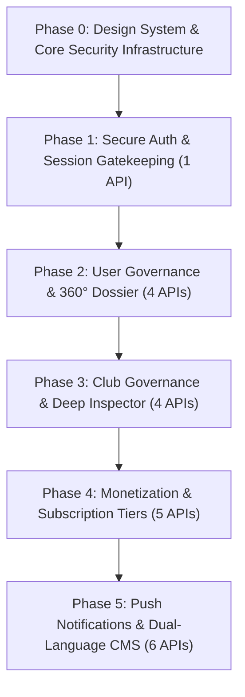

# Phased System Design & Secure Implementation Blueprint

> **Project:** Ride With Pals — Admin Control Center  
> **Source Specifications:** [`Admin.postman_collection.json`](file:///c:/Users/Prime/OneDrive/Documents/Office/Office%20Projects/Ride-WP-Admin/Admin.postman_collection.json) & [`API_ANALYSIS_WALKTHROUGH.md`](file:///c:/Users/Prime/OneDrive/Documents/Office/Office%20Projects/Ride-WP-Admin/API_ANALYSIS_WALKTHROUGH.md)  
> **Methodology:** **System Design First → UI/UX Manufacturing → Secure API Integration → Verification**  

---

## 1. Executive Summary: 5-Phase Roadmap

To implement all 20 APIs safely, reliably, and securely without regression, the rollout is structured into **5 sequential phases** preceded by a foundational **Phase 0 (System Design & Reusable Component System)**.



| Phase | Core Domain | APIs Covered | Primary Reusable Components | Security & Resilience Focus |
| :---: | :--- | :---: | :--- | :--- |
| **0** | **Design System & Security Foundation** | — | `DataTable`, `ModalDialog`, `StatusBadge`, `ActionMenu`, `StatCard` | Axios Interceptors, JWT Storage, Global Error Boundaries, Zod Schemas |
| **1** | **Auth & Session Gatekeeper** | 1 | `LoginForm`, `ProtectedRoute`, `BackgroundBubbles`, `ThemeToggle` | JWT Integrity, Token Expiry, Auto-logout, Brute-Force Rate Limiting |
| **2** | **User Management & Moderation** | 4 | `DataTable`, `DetailTabs`, `UserActionsMenu`, `ConfirmModal`, `SafeImage` | Optimistic Suspension, Cascading Delete Warning, Sanitized Search |
| **3** | **Club Governance & Community** | 4 | `DataTable`, `ClubDetailTabs`, `ClubActionsMenu`, `MetricCard` | Sub-resource Tab Caching, Quota Integrity, Suspension Cascade |
| **4** | **Monetization & Subscriptions** | 5 | `CreateEditPlanModal`, `SubscriptionPlansTable`, `ToggleSwitch` | Stripe Price Synchronization, Plan Feature Flag Validation, Safe Archival |
| **5** | **Push Broadcasts & CMS** | 6 | `CompositionPanel`, `RecipientSelector`, `PreviousNotifications`, `CMSContentEngine` | FCM Payload Schema Validation, XSS-Safe Markdown Parser, Dual-Language (EN/ES) Sync |

---

## Phase 0: System Design & Reusable Component Architecture

Before writing any domain feature, we establish the **Core Design System** and **Transport/Security Layer** to eliminate code duplication and enforce consistent aesthetics.

### 0.1 Security & Transport Architecture
1. **Standardized Axios Transport Layer:**
   * Centralized in [`src/api/baseQuery.ts`](file:///c:/Users/Prime/OneDrive/Documents/Office/Office%20Projects/Ride-WP-Admin/src/api/baseQuery.ts).
   * Request Interceptor automatically injects `Authorization: Bearer <token>` from secure storage.
   * Response Interceptor unwraps the universal envelope `{ statusCode, message, response }` and standardizes network errors into user-friendly notifications via `Sonner`.
2. **Global Error Boundaries:**
   * Implemented in [`GlobalErrorBoundary.tsx`](file:///c:/Users/Prime/OneDrive/Documents/Office/Office%20Projects/Ride-WP-Admin/src/Components/common/GlobalErrorBoundary.tsx) and [`RouteErrorBoundary.tsx`](file:///c:/Users/Prime/OneDrive/Documents/Office/Office%20Projects/Ride-WP-Admin/src/Components/common/RouteErrorBoundary.tsx) to prevent white-screen crashes on network anomalies.

### 0.2 Design System Tokens & Component Catalog
All UI screens strictly reuse the standardized Design Tokens:
* **Typography:** `font-poppins` for headers/KPIs, `font-roboto` for data tables and body text.
* **Colors:** Accent (`#EB712B`), Surface (`bg-surface`), Border (`border-border`), Background (`bg-main-bg`).
* **Reusable UI Component Catalog:**
  1. [`DataTable<T>`](file:///c:/Users/Prime/OneDrive/Documents/Office/Office%20Projects/Ride-WP-Admin/src/Components/ui/DataTable.tsx): Server-side sorting, debounced search, responsive pagination, skeleton loading states.
  2. `StatusBadge`: Unified pill rendering `Active`, `Suspended`, `Private`, `Public`, `Delivered`, `Failed`.
  3. `ActionMenu`: Portal-based dropdown with auto-repositioning to avoid overflow clipping.
  4. `ConfirmModal`: Accessible confirmation modal with destructive warning states for suspensions and deletions.
  5. [`SafeImage`](file:///c:/Users/Prime/OneDrive/Documents/Office/Office%20Projects/Ride-WP-Admin/src/Components/common/SafeImage.tsx): Image fallback component handling CDN loading errors gracefully.

---

## Phase 1: Authentication & Access Control

### 1.1 System Design & Security Specification
* **API Covered:** `POST /admin/login`
* **Data Contract:**
  ```typescript
  // Request
  interface LoginAdminRequest {
    email: string;
    password: string;
  }
  // Response
  interface LoginAdminResponse {
    id: number;
    email: string;
    name: string;
    role: 'admin';
    token: string;
  }
  ```
* **Security Controls:**
  * Client-side email and password sanitization via Zod schema.
  * Storing token in `localStorage` under `rwp_admin_token` and synchronizing with Redux `authSlice`.
  * Redirection guard in [`ProtectedRoute.tsx`](file:///c:/Users/Prime/OneDrive/Documents/Office/Office%20Projects/Ride-WP-Admin/src/Components/layout/ProtectedRoute.tsx) blocking unauthorized URL access.
  * Expiry handler: Any `401 Unauthorized` response triggers instant token purge and redirection to `/login`.

### 1.2 UI/UX Manufacturing
* **Components:** [`LoginPage.tsx`](file:///c:/Users/Prime/OneDrive/Documents/Office/Office%20Projects/Ride-WP-Admin/src/features/auth/components/LoginPage.tsx), [`LoginForm.tsx`](file:///c:/Users/Prime/OneDrive/Documents/Office/Office%20Projects/Ride-WP-Admin/src/features/auth/components/LoginForm.tsx), [`BackgroundBubbles.tsx`](file:///c:/Users/Prime/OneDrive/Documents/Office/Office%20Projects/Ride-WP-Admin/src/Components/ui/BackgroundBubbles.tsx).
* **User Experience:**
  * Animated background bubbles with smooth floating effect.
  * Form inputs with floating icons, password reveal toggle, and inline validation warnings.
  * Animated loader (`Loader2`) on submit with button disable state to prevent duplicate submissions.

---

## Phase 2: User Governance, Moderation & 360° Dossier

### 2.1 System Design & Security Specification
* **APIs Covered:**
  * `GET /admin/users` (List & Search)
  * `GET /admin/users/:id` (User Dossier)
  * `PUT /admin/users/:id/suspend` (Suspend/Unsuspend)
  * `DELETE /admin/users/:id` (Permanent Deletion)
* **Cache Invalidation Topology:**
  * `getUsersList` provides `{ type: 'Users', id: 'LIST' }` and `{ type: 'Users', id: user.id }`.
  * `suspendUser` invalidates `{ type: 'Users', id: userId }` and `{ type: 'Users', id: 'LIST' }`.
  * `deleteUser` invalidates `{ type: 'Users', id: 'LIST' }`.
* **Security Controls:**
  * Confirmation modal requiring explicit user verification before issuing destructive actions.
  * Search input debouncing (300ms) via [`useDebounce.ts`](file:///c:/Users/Prime/OneDrive/Documents/Office/Office%20Projects/Ride-WP-Admin/src/hooks/useDebounce.ts) to prevent API spamming.

### 2.2 UI/UX Manufacturing
* **Components:**
  * **User Directory:** [`UsersPage.tsx`](file:///c:/Users/Prime/OneDrive/Documents/Office/Office%20Projects/Ride-WP-Admin/src/features/users/pages/UsersPage.tsx) using generic `DataTable<UserListItem>`.
  * **Actions:** [`UserActionsMenu.tsx`](file:///c:/Users/Prime/OneDrive/Documents/Office/Office%20Projects/Ride-WP-Admin/src/features/users/components/UserActionsMenu.tsx) with portal dropdown and GSAP micro-animation.
  * **User Dossier:** [`UserDetailPage.tsx`](file:///c:/Users/Prime/OneDrive/Documents/Office/Office%20Projects/Ride-WP-Admin/src/features/users/pages/UserDetailPage.tsx) with hero stats (`totalRides`, `distanceCovered`, `userReputation`) and [`DetailTabs.tsx`](file:///c:/Users/Prime/OneDrive/Documents/Office/Office%20Projects/Ride-WP-Admin/src/features/users/components/DetailTabs.tsx) for Rides, Clubs, Listings, and Purchases.

---

## Phase 3: Club Governance & Multi-Tab Deep Inspector

### 3.1 System Design & Security Specification
* **APIs Covered:**
  * `GET /admin/clubs` (List & Search)
  * `GET /admin/clubs/:id?tab=...` (Tabbed Club Inspector)
  * `PUT /admin/clubs/:id/suspend` (Suspend Club)
  * `DELETE /admin/clubs/:id` (Disband Club)
* **Sub-Resource Protocol:**
  * When `tab` is empty, fetches club header profile & high-level stats (`activeMembers`, `groupRuns`, `revenue`).
  * When `tab` is active (`rides`, `members`, `news`, `leaderboard`, `shop`, `discounts`, `marketplace`), fetches the dedicated paginated sub-collection.
* **Cache Architecture:**
  * Tag type `'Clubs'` ensures suspending a club immediately refreshes both the club list and club detail views.

### 3.2 UI/UX Manufacturing
* **Components:**
  * [`ClubsPage.tsx`](file:///c:/Users/Prime/OneDrive/Documents/Office/Office%20Projects/Ride-WP-Admin/src/features/clubs/pages/ClubsPage.tsx) with club cards and table views.
  * [`ClubDetailsPage.tsx`](file:///c:/Users/Prime/OneDrive/Documents/Office/Office%20Projects/Ride-WP-Admin/src/features/clubs/pages/ClubDetailsPage.tsx) with cover banner, organizer contact badge, and [`ClubDetailTabs.tsx`](file:///c:/Users/Prime/OneDrive/Documents/Office/Office%20Projects/Ride-WP-Admin/src/features/clubs/components/ClubDetailTabs.tsx).
  * Smooth tab switching transitions powered by GSAP.

---

## Phase 4: Monetization & Subscription Tier Management

### 4.1 System Design & Security Specification
* **APIs Covered:**
  * `POST /admin/subscription/plan`
  * `GET /admin/subscription/plans`
  * `GET /admin/subscription/plan?planId=X`
  * `PUT /admin/subscription/plan`
  * `DELETE /admin/subscription/plan`
* **Feature Entitlements Schema (Zod Validation):**
  ```typescript
  const planSchema = z.object({
    name: z.string().min(2),
    description: z.string().min(5),
    price: z.number().min(0),
    currency: z.string().default('eur'),
    billingInterval: z.enum(['free', 'monthly', 'yearly']),
    planScope: z.enum(['user', 'club']),
    trialPeriodDays: z.number().nullable().optional(),
    config: z.object({
      numberOfRides: z.number().optional(),
      marketplaceItems: z.number().optional(),
      unlimitedRides: z.boolean().default(false),
      stravaConnection: z.boolean().default(false),
      gpxDownload: z.boolean().default(false),
      clubStripeIntegration: z.boolean().default(false),
      unlimitedClubMembers: z.boolean().default(false),
      paidActivities: z.boolean().default(false),
    }),
    isActive: z.boolean().default(true),
  });
  ```
* **Stripe Integration Safeguard:** Deleting a plan performs a soft-delete (`isDeleted: true`, `isActive: false`) to preserve past billing invoices and active recurring memberships.

### 4.2 UI/UX Manufacturing
* **Components:**
  * [`PaymentsPage.tsx`](file:///c:/Users/Prime/OneDrive/Documents/Office/Office%20Projects/Ride-WP-Admin/src/features/payments/pages/PaymentsPage.tsx) with segmented switcher between Wallet & Subscriptions.
  * [`SubscriptionPlansTable.tsx`](file:///c:/Users/Prime/OneDrive/Documents/Office/Office%20Projects/Ride-WP-Admin/src/features/subscriptions/components/SubscriptionPlansTable.tsx) with quota summary badges.
  * [`CreateEditPlanModal.tsx`](file:///c:/Users/Prime/OneDrive/Documents/Office/Office%20Projects/Ride-WP-Admin/src/features/subscriptions/components/CreateEditPlanModal.tsx) with interactive feature toggles, price input, and currency selectors.

---

## Phase 5: Push Notifications & Dual-Language CMS

### 5.1 System Design & Security Specification
* **APIs Covered:**
  * Push: `POST /admin/notifications/send`, `GET /admin/users/picker`, `GET /admin/notifications/history`
  * CMS: `GET /public/content/:key`, `GET /admin/content/:key`, `PUT /admin/content/:key`
* **Data Contract Alignment:**
  * Ensures push notifications payload strictly adheres to the Postman contract:
    * `title`, `body`, `targetSegment: 'all' | 'specific'`, `userIds?: number[]`, `imageUrl?: string`.
* **CMS Multi-Language Engine:**
  * Supports dual English/Spanish editing (`title`, `content`, `titleEs`, `contentEs`).
  * XSS prevention: Clean sanitization before rendering markdown or HTML preview.

### 5.2 UI/UX Manufacturing
* **Components:**
  * **Notifications:** [`NotificationPage.tsx`](file:///c:/Users/Prime/OneDrive/Documents/Office/Office%20Projects/Ride-WP-Admin/src/features/notifications/pages/NotificationPage.tsx), [`CompositionPanel.tsx`](file:///c:/Users/Prime/OneDrive/Documents/Office/Office%20Projects/Ride-WP-Admin/src/features/notifications/components/CompositionPanel.tsx), [`RecipientSelector.tsx`](file:///c:/Users/Prime/OneDrive/Documents/Office/Office%20Projects/Ride-WP-Admin/src/features/notifications/components/RecipientSelector.tsx), [`PreviousNotifications.tsx`](file:///c:/Users/Prime/OneDrive/Documents/Office/Office%20Projects/Ride-WP-Admin/src/features/notifications/components/PreviousNotifications.tsx).
  * **Legal CMS:** [`PrivacyPolicyPage.tsx`](file:///c:/Users/Prime/OneDrive/Documents/Office/Office%20Projects/Ride-WP-Admin/src/features/cms/pages/PrivacyPolicyPage.tsx), [`TermsConditionsPage.tsx`](file:///c:/Users/Prime/OneDrive/Documents/Office/Office%20Projects/Ride-WP-Admin/src/features/cms/pages/TermsConditionsPage.tsx), and [`CMSContentEngine.tsx`](file:///c:/Users/Prime/OneDrive/Documents/Office/Office%20Projects/Ride-WP-Admin/src/features/cms/components/CMSContentEngine.tsx).

---

## 6. End-to-End Quality & Verification Strategy

Each phase concludes with a mandatory **Security & Regression Verification Gate**:

1. **Authentication & Session:** Verify token persistence, route protection, and auto-redirection on 401.
2. **Network Resilience:** Verify offline banner and toast error handling for 500 errors.
3. **Cache Synchronization:** Ensure mutations (`suspend`, `delete`, `update`) instantly reflect across list and detail views without hard reloads.
4. **Responsive Layouts:** Verify all screens across Desktop (1440px), Laptop (1024px), Tablet (768px), and Mobile (375px).
5. **Dark/Light Theme Contrast:** Verify contrast ratios meet WCAG AA standards in both light and dark themes.
