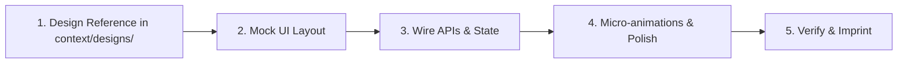

# Build Plan: Ride With Pals Admin Control Center

## 1. Core Agile Methodology

1. **Design Reference Ingestion:** Check `context/designs/` for mockups, wireframes, or screenshots provided for the active screen.
2. **Mock UI Layout First:** Build the visual layout with realistic mock fixtures and Tailwind v4 design tokens. Visually inspect in browser.
3. **Wire APIs & State:** Connect Redux Toolkit, RTK Query / Axios endpoints, or Socket.io events.
4. **Micro-animations & Polish:** Add GSAP transitions, hover states, skeleton loaders, and non-blocking toast feedback.
5. **Verify & Imprint:** Execute build checks and update `context/ui-registry.md` using `/imprint`.

---

## 2. Phased Implementation Roadmap

### Phase 0: System Design & Transport Infrastructure
- **Transport:** Standardized Axios baseQuery in `src/api/baseQuery.ts` with JWT bearer authorization and universal response envelope unwrapping (`{ statusCode, message, response }`).
- **Error Boundaries:** `GlobalErrorBoundary.tsx` and `RouteErrorBoundary.tsx`.
- **Core Components:** `DataTable<T>`, `StatusBadge`, `ActionMenu`, `ConfirmModal`, `SafeImage`.

---

### Phase 1: Authentication & Gatekeeping (1 API)
- **API:** `POST /admin/login`
- **Screens:** `LoginPage.tsx`, `LoginForm.tsx`, `BackgroundBubbles.tsx`.
- **Security:** Zod login schema, JWT storage under `rwp_admin_token`, `ProtectedRoute.tsx` redirection, auto-logout on `401 Unauthorized`.

---

### Phase 2: User Governance & 360° Athlete Dossier (4 APIs)
- **APIs:**
  - `GET /admin/users` (List & debounced search)
  - `GET /admin/users/:id` (Athlete Dossier)
  - `PUT /admin/users/:id/suspend` (Optimistic suspension toggle)
  - `DELETE /admin/users/:id` (Permanent deletion with `ConfirmModal`)
- **Screens:** `UsersPage.tsx`, `UserDetailPage.tsx`, `DetailTabs.tsx` (Activities, Clubs, Orders, Marketplace, Moderation).

---

### Phase 3: Club Governance & Deep Tabbed Inspector (4 APIs)
- **APIs:**
  - `GET /admin/clubs` (Directory with tier & verification filters)
  - `GET /admin/clubs/:id?tab=...` (Tabbed Sub-Resource Inspector: `members`, `rides`, `news`, `leaderboard`, `shop`, `discounts`, `marketplace`)
  - `PUT /admin/clubs/:id/suspend` (Suspend/Reactivate Club)
  - `DELETE /admin/clubs/:id` (Disband Club with cascading warnings)
- **Screens:** `ClubsPage.tsx`, `ClubDetailsPage.tsx`, `ClubDetailTabs.tsx`.

---

### Phase 4: Monetization & SaaS Subscription Plans (5 APIs)
- **APIs:**
  - `POST /admin/subscription/plan`
  - `GET /admin/subscription/plans`
  - `GET /admin/subscription/plan?planId=:id`
  - `PUT /admin/subscription/plan`
  - `DELETE /admin/subscription/plan` (Soft delete / archival)
- **Entitlements:** Zod schema validation for plan feature flags (`numberOfRides`, `marketplaceItems`, `unlimitedRides`, `stravaConnection`, `gpxDownload`, `clubStripeIntegration`, etc.).
- **Screens:** `PaymentsPage.tsx` (Segmented Tabs), `SubscriptionPlansTable.tsx`, `CreateEditPlanModal.tsx`.

---

### Phase 5: Push Broadcasts & Dual-Language CMS (6 APIs)
- **Push APIs:** `POST /admin/notifications/send`, `GET /admin/users/picker`, `GET /admin/notifications/history`.
- **CMS APIs:** `GET /public/content/:key`, `GET /admin/content/:key`, `PUT /admin/content/:key`.
- **Screens:**
  - `NotificationPage.tsx`, `CompositionPanel.tsx`, `RecipientSelector.tsx`, `PreviousNotifications.tsx`.
  - `PrivacyPolicyPage.tsx`, `TermsConditionsPage.tsx`, `AboutPage.tsx`, `CMSContentEngine.tsx` (dual English/Spanish tabs).

---

### Phase 6: Real-time Customer Support Helpdesk (Socket.io)
- **Socket Protocol:** `support:threads:list`, `support:thread:join`, `support:thread:leave`, `support:message:send`, `support:messages:list`, `support:thread:read`, `support:message:new`.
- **Screens:** `SupportPage.tsx` with Ticket Queue sidebar, active chat viewport, unread counters, and refund action buttons.

---

### Phase 7: Activities, Group Rides & GPX Routes
- **APIs:** `GET /admin/rides`, `GET /admin/rides/:id`, `DELETE /admin/rides/:id`.
- **Features:** GPX route visualization, elevation profile, participant rosters, ride leader badges, and emergency cancellation broadcast.

---

### Phase 8: Financial Operations & Stripe Connect Ledger
- **APIs:** `GET /admin/financials/ledger`, `GET /admin/financials/stripe-accounts`, `PUT /admin/financials/payouts/:id/approve`.
- **Features:** Gross transaction ledger (membership dues, merchandise, SaaS), Stripe Connect merchant onboarding statuses, manual withdrawal approvals.

---

### Phase 9: Commerce & Marketplace Operations
- **APIs:** `GET /admin/marketplace/listings`, `PUT /admin/marketplace/listings/:id/moderate`, `GET /admin/shop/orders/bottlenecks`.
- **Features:** P2P gear listing takedowns, fraudulent seller moderation, club merchandise delivery tracking and bottleneck resolution.
